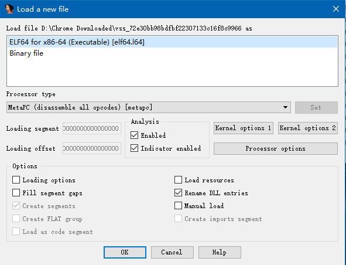
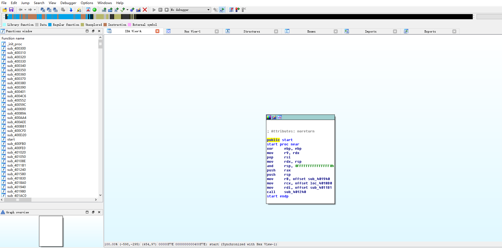
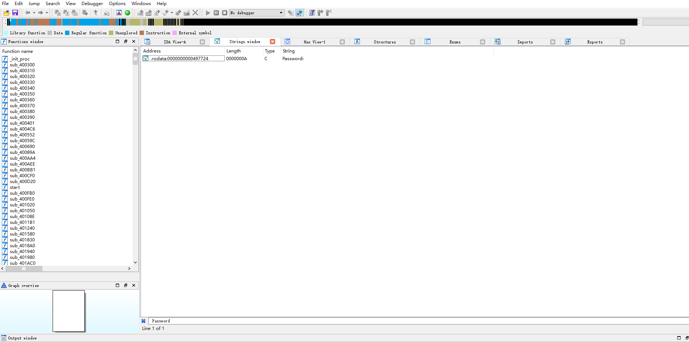
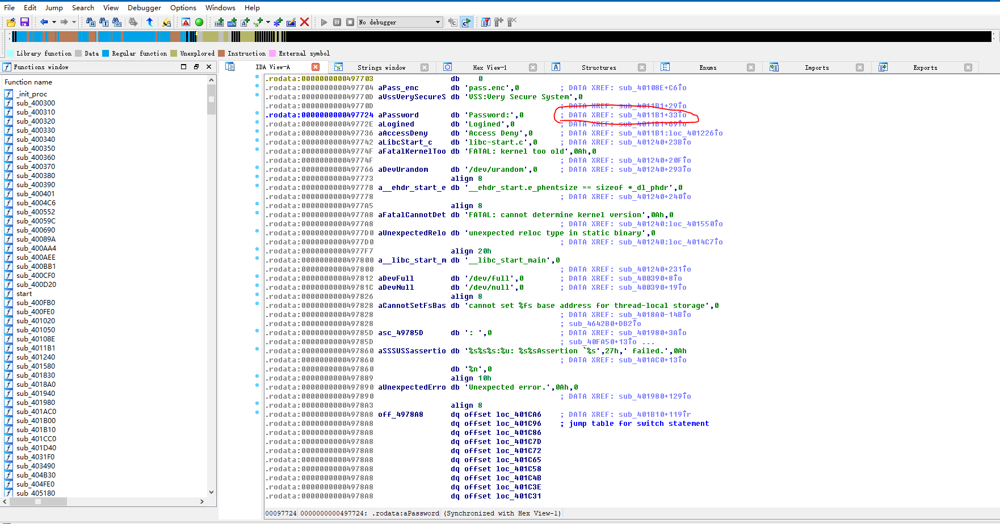
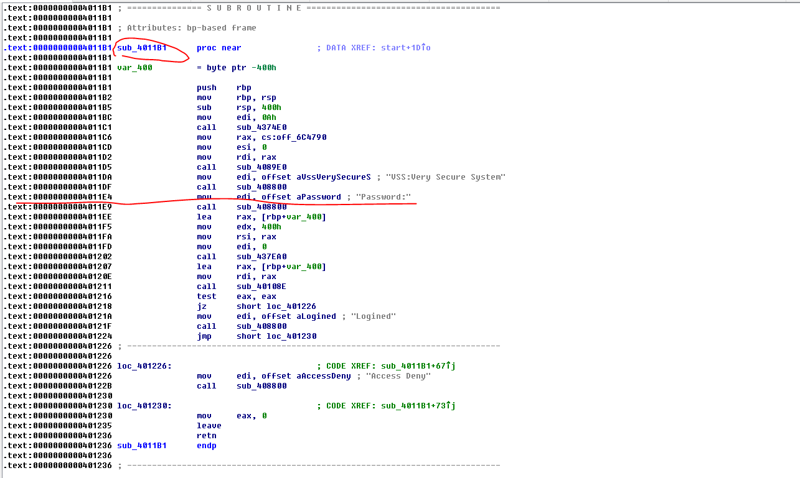
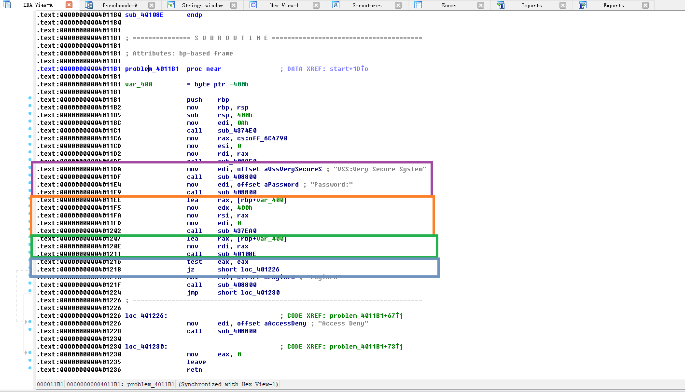
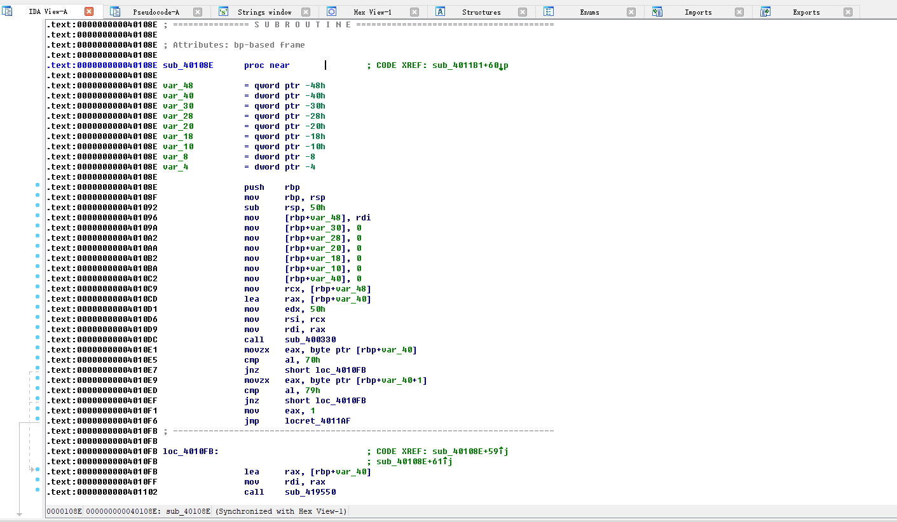
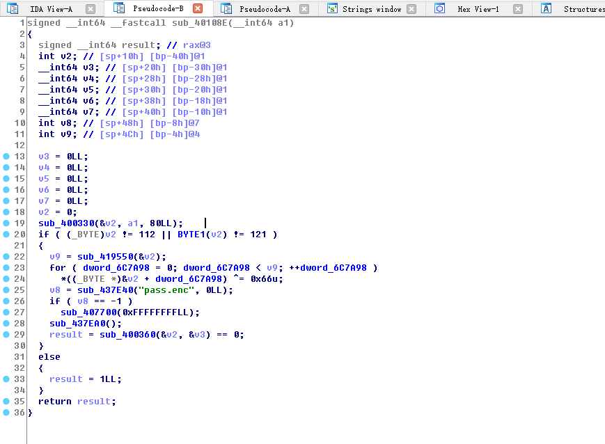

# VSS (Very secure System)
 **使用到pwntools**
  ```
  $sudo pip install pwntools
  ```
 **ROPgadget Tool** [GitHub页面](https://github.com/JonathanSalwan/ROPgadget)

 **IDA**
## 第一步、初步分析目标程序
 * 1.使用file命令查看文件类型
  ```
  root@VM-206-74-ubuntu:/workspace/rop/vss# file vss
  vss: ELF 64-bit LSB executable, x86-64, version 1 (GNU/Linux), statically linked, for GNU/Linux 2.6.24, BuildID[sha1]=5589f2e4e8d5a8e810f9b425baabccc04745b40a, stripped
  ```
  __x86-64, version 1 (GNU/Linux), statically linked, for GNU/Linux 2.6.24__ 64位静态链接的在linux上跑的程序
 
  __stripped__ 意思是目标文件里面的符号信息在编译的时候删掉了，这意味着API名称是看不到的，想知道被call的API名称是什么需要分析传递的参数
 
 * 2.使用checksec命令查看保护措施 
  ```
  root@VM-206-74-ubuntu:/workspace/rop/vss# checksec vss
  [*] '/workspace/rop/vss/vss'
      Arch:     amd64-64-little
      RELRO:    Partial RELRO
      Stack:    No canary found
      NX:       NX enabled
      PIE:      No PIE (0x400000)
  ```
  开启了NX

## 第二步、逆向分析目标程序
 * 1.首先正常运行一下程序
  ```
  root@VM-206-74-ubuntu:/workspace/rop/vss# ./vss 
  VSS:Very Secure System
  Password:
  HAHAHAHAHA
  root@VM-206-74-ubuntu:/workspace/rop/vss# 
  ```
  运行程序要求输入密码，随便输入了字符串然后回车，并没有什么反应
  程序有获取输入的操作，试试输入超长的字符串看看会不会崩掉
  ```
   $ python
   >>"A" * 1024
   >>#输出一个1024个A的字符串，这就不放了
   >>exit()
  ```

  复制这个超长的字符串，运行程序，粘贴作为密码
  ```
   root@VM-206-74-ubuntu:/workspace/rop/vss# ./vss 
   VSS:Very Secure System
   Password:
   AAAAAAAAAAAAAAAAAAAAAAAAAAAAAAAAAAAAAAAAAAAAAAAAAAAAAAAAAAAAAAAAAAAAAAAAAAAAAAAAAAAAAAAAAAAAAAAAAAAAAAAAAAAAAAAAAAAAAAAAAAAAAAAAAAAAAAAAAAAAAAAAAAAAAAAAAAAAAAAAAAAAAAAAAAAAAAAAAAAAAAAAAAAAAAAAAAAAAAAAAAAAAAAAAAAAAAAAAAAAAAAAAAAAAAAAAAAAAAAAAAAAAAAAAAAAAAAAAAAAAAAAAAAAAAAAAAAAAAAAAAAAAAAAAAAAAAAAAAAAAAAAAAAAAAAAAAAAAAAAAAAAAAAAAAAAAAAAAAAAAAAAAAAAAAAAAAAAAAAAAAAAAAAAAAAAAAAAAAAAAAAAAAAAAAAAAAAAAAAAAAAAAAAAAAAAAAAAAAAAAAAAAAAAAAAAAAAAAAAAAAAAAAAAAAAAAAAAAAAAAAAAAAAAAAAAAAAAAAAAAAAAAAAAAAAAAAAAAAAAAAAAAAAAAAAAAAAAAAAAAAAAAAAAAAAAAAAAAAAAAAAAAAAAAAAAAAAAAAAAAAAAAAAAAAAAAAAAAAAAAAAAAAAAAAAAAAAAAAAAAAAAAAAAAAAAAAAAAAAAAAAAAAAAAAAAAAAAAAAAAAAAAAAAAAAAAAAAAAAAAAAAAAAAAAAAAAAAAAAAAAAAAAAAAAAAAAAAAAAAAAAAAAAAAAAAAAAAAAAAAAAAAAAAAAAAAAAAAAAAAAAAAAAAAAAAAAAAAAAAAAAAAAAAAAAAAAAAAAAAAAAAAAAAAAAAAAAAAAAAAAAAAAAAAAAAAAAAAAAAAAAAAAAAAAAAAAAAAAAAAAAAAAAAAAAAAAAAAAAAAAAAAAAAAAAAAAAAAAAAAAAAAAAAAAAAAAAAAAAAAAAAAAAAAAAAAAAAAAAAAAAAAAAAAAAAAAAAAAAAAAAAAAAAAAAAAAAAAAAAAAAAAAAAAAAAAAAAAAAAAAAAAAAAAAAAAAAAAAAAAAAAAAAAAAAAAAAAAAAAAAAA
   Segmentation fault (core dumped)
   root@VM-206-74-ubuntu:/workspace/rop/vss#
   ```
  __Segmentation fault (core dumped)__ 崩了，说明有溢出的问题

 * 2.IDA分析
  首先打开用IDA打开目标文件(注意64位)
  
  符号信息果然是没有的
  
  这里不直接找main函数，而是通过字符串引用来找溢出点(可以从函数start那找main函数，这里因为嫌他相对麻烦一些，所以用查找字符串引用来确定溢出位置)
  从第一步我们知道运行程序后，程序输出“Password:”，然后要求我们输入密码 
  所以搜索字符串。在IDA中按Shift+F12，IDA会列出程序中使用的所有字符串，此时在control+F，在弹出的编辑框中输入Password
  
  双击结果行，IDA View-A窗口会定位到这个字符串在程序中存储的位置，这时能看到db 'Password'后面有注释，写的是DATA XREF subxxx，意思是 subxxx处引用了这个字符串
  
  双击那行注释，IDA View-A窗口会定位到subxxx地址处，这个地址对应的汇编代码引用了这个字符串
  
  分析下这个函数
  
  紫色部分call了两次sub\_408800这个函数，参数为运行程序后出现字符串(64位程序传参会把前几个参数放进寄存器中)
  那么这个函数应该相当于printf之类的打印函数
  橙色部分调用了一个函数，以0，一个指针，0x400作为参数，其中参数中的指针为rbp-0x400
  绿色部分call了一个函数，参数为刚才的那个指针。我们可以双击call后面的地址，看一下这个函数
  
  一堆汇编代码，看不出个大概可以尝试F5大法，看反编译代码
  
  形参a1为我们输入的字符串的指针
  调用了一个函数sub\_400330(&v2, a1, 0x50LL);，参数是rbp-0x40, 我们输入的字符串的指针，0x50,参数一是一个能存储0x40字节大小的内存区域，参数二是一个字符串，参数三为一个数值。那么可能这个函数是一个类似于strcpy之类的函数
  百度了一下这种参形式的C API，发现这个函数应该是strncpy
  那么这个函数在这里的作用是截取我们输入的前0x50个字符，复制到栈中
  由于参数一的空间大小只有0x40,只要我们输入的前0x40个字节中不带\0，那么余下的字符就会造成栈溢出

  调用完这个函数后还会有一个if判断，调用两个函数。以0x40字节大小的缓冲区指针作为参数，判断返回值是不是分别等于112 和 121
  ASCII码是小于128的，有可能是ASCII码。右键这个数值，选Char选项，发现这两个数值分别是字符'p'和'y'，如果是的话那么返回1，否则就调用一些函数，返回0
  至于这两个函数判断的是缓冲区中哪个位置的数据，我们可以看汇编代码，发现是[rbp+var\_40] 和 [rbp+var\_40+1], var\_40的数值在前面有定义，是-40。所以这两个函数是返回我们输入的前两个字符
  也就是说判断的是我们输入的前两个字符
  到这我们分析完了发生溢出的函数，我们可以写攻击程序了。

 * 3.编写攻击程序

